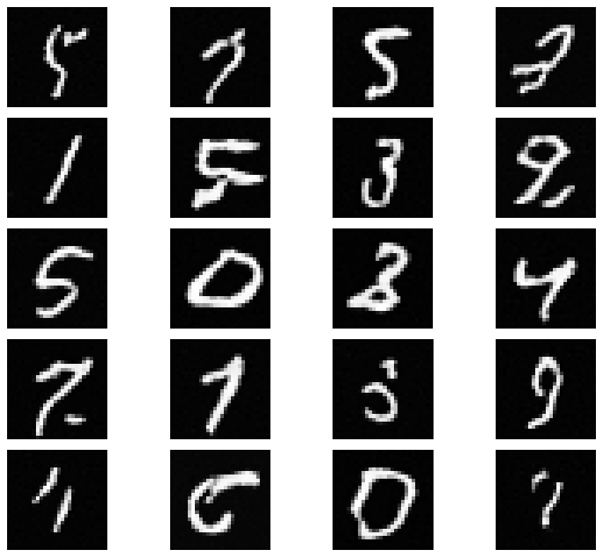

# Overview
This repo contains implementations of flow matching for MNIST digit generation. The denoiser is implemented as U-Net. There are implementations of both time-conditioned and time-and-class-conditioned U-Nets to allow for experimenting with and without classifier-free guidance. 

# Running Code / Training Models

The easiest way to run this code is to download it to google drive and create a Colab notebook inside the main directory. This ensures all necessary libraries are available and enables access to a GPU for faster training.

To train the flow matching model **without** classifier-free guidance, cd into **training** and run:
```
python3 train_classuncond.py
```

To train the flow matching model **with** classifier-free guidance run:
```
python3 train_classcond.py
```
again from the **training** directory.

To log training curves in a Weights and Biases account, first create a new project in the Weights and Biases console. Then pass the argument

```
--wandb-project [PROJECT_NAME]
```
when running either of the training scripts as shown above.

The training hyperparameters set to default in the training scripts yield the best performance, in my experience. However, see the scripts for information on how to pass custom hyperparameters.

# Sample Results

The following are samples drawn after 5 epochs of training **without** classifier-free guidance. Weights can be found under the weights/UnconditionalFlowMatching directory.




The following are samples drawn after 5 epochs of training **with** classifier-free guidance. Weights can be found under the weights/ClassConditionedFlowMatching directory.


As evidenced by the above samples, using classifier-free guidance yields much better results. 


